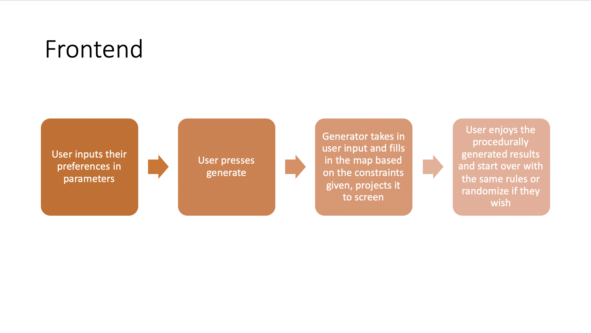
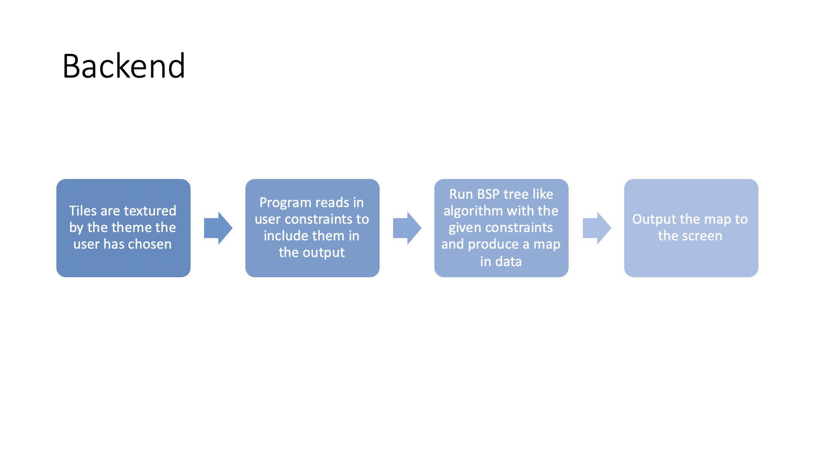
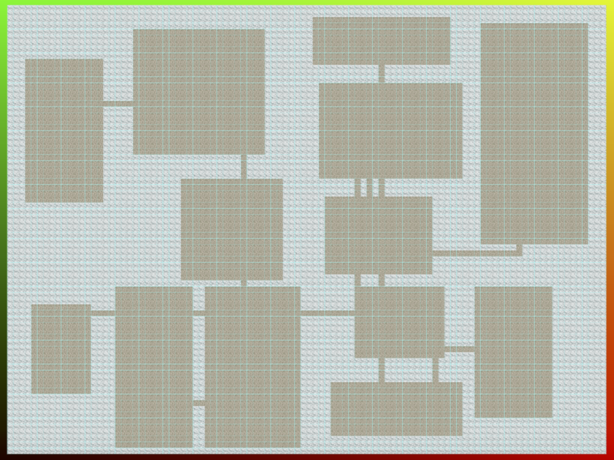
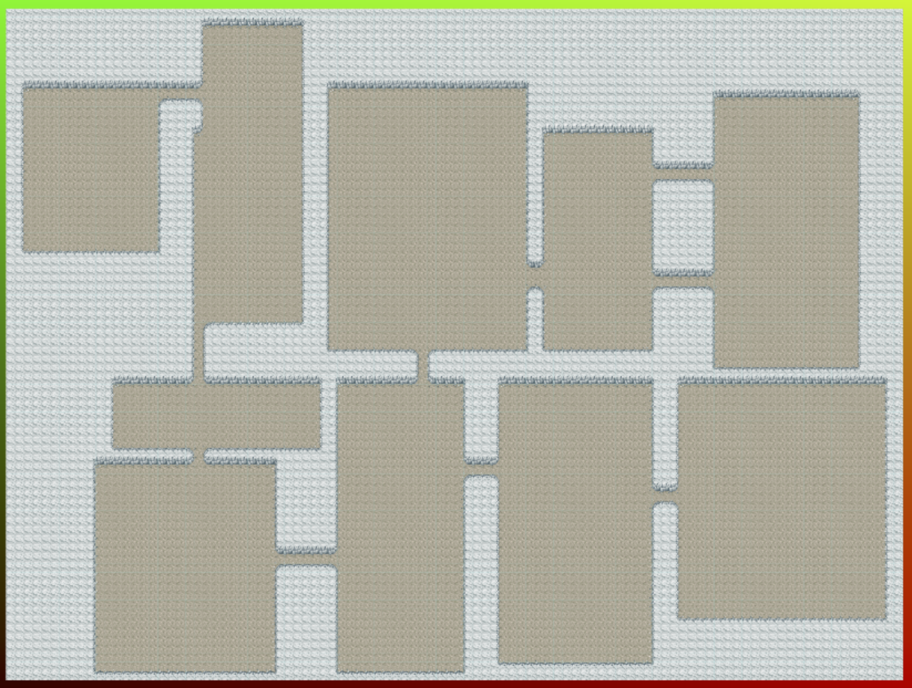
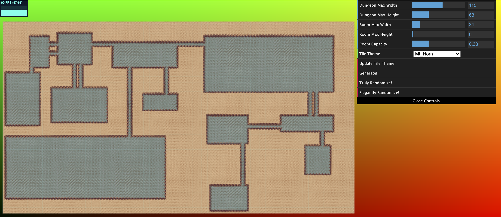

# Meggie's 566 Final Project

### View Project
- https://tauntybird.github.io/final-project/
- Note: right click and drag to pan, scroll to zoom in/out. The map starts out really close to the camera; I suggest zooming out a bit!

### Design Doc

#### Introduction
- Lots of games use tilemaps to create their environments. One of the most notable series that heavily use this technique is Pokemon, particularly their older GBA and DS games such as Pokemon Red, Pokemon Pearl, and the Pokemon Mystery Dungeon series. This art style is very modular and can be reconfigured into an infinite variety of town/wilderness/dungeon layouts for players to experience.

#### Goal
- I want to create a procedural pokemon dungeon generator where given some user input parameters (maybe type of terrain/biome, size of rooms, and other preferences) a user can generate a unique pokemon dungeon map that one could imagine exploring in a 2d pokemon game.

#### Inspiration/reference:
- 
- 

#### Specification (Main features):
- User input dungeon generation related parameters
- Lots of pokemon tilemap asset themes to choose from
- Binary Space Partitioning (BSP) based procedural generator

#### Techniques:
- I plan to use a form of BSP to generate a map given assets and their constraints
- http://pcgbook.com/wp-content/uploads/chapter03.pdf
- https://www.youtube.com/watch?v=TlLIOgWYVpI

#### Design:
- 
- 

#### Timeline:
- By Milestone 2 (11/22): Figure out how to reuse past homework bases into 2d format for this generator, research generator algorithm and set up necessary classes/variables for the base logic, find/download/organize assets in a way that is easy for code to access
- By Milestone 3 (11/29): Keep tweaking the algorithm by making it generate more complex/beautiful results, allow user input parameters to change the outcome, add more assets in for more variety if desired/able to
- By Final Submission (12/6): Keep polishing, add NPCs and other details (items, pokemon) if you have time

#### Milestone 2:
- 
- Added UV texturing, able to read tiles from a standardized tile sheet format. Only using two basic tiles for testing purposes this week, will prettify it next milestone
- Coded basic procedural generator first using BSP to generate rooms and connecting them with corridors afterwards

#### Milestone 3:
- 
- Mapped proper tiles to the layout of the dungeon (using UV coord system set up in Milestone 2)
- Added some basic sliders for dungeon generation
- "Fixed" bright sprite borders from showing (moved all the UV coordinates in by ~1 px)
- Made tiles guess textures based on closest neighbor similarity if existing texture for situation did not exist in tile sheet

#### Final Submission:
- 
- Added option to pick between different tile maps (hand stitched the tile maps together in Photoshop to the same dimensions :'D)
- Added randomizer options in sliders
- Cleaned up code
- Overall the project went well! I was originally going to do wave function collapse but got frustrated by the lack of good, readable, more modern pokemon tile sheets (probably too impatient at the start there). The pokemon dungeon tilesheets were good so I went with that instead. I pivoted to using BSP algorithm because looking at the pokemon mystery dungeon maps, I feel like they were better mimicked with that algorithm rather than WFC. I accomplished most of my goals with the basic generator and am happy with the amount of user input there is. If I had more time I would like to add even more sliders, or make it playable, or also implement WFC as another generation option. But I'm pretty happy with the final result as it is now.

#### Tile Sheet Credits:
- Sprites are from Pokemon Mystery Dungeon: Explorers of Time/Darkness. Copyright © 2008 by Nintendo, The Pokémon Company, Spike Chunsoft
- Ripped sprite sheets are by SilverDeoxys563 on Spriters Resource: https://www.spriters-resource.com/submitter/SilverDeoxys563/
